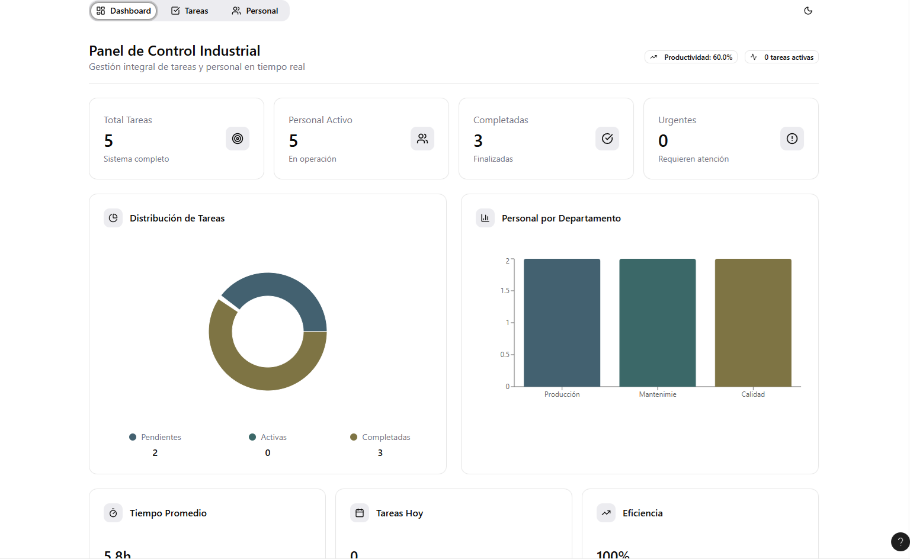
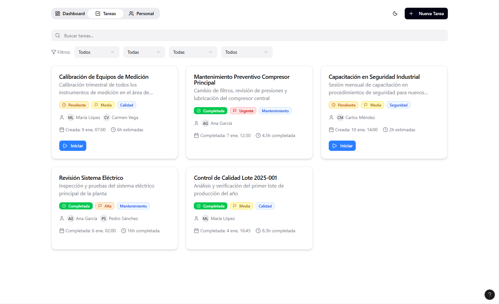
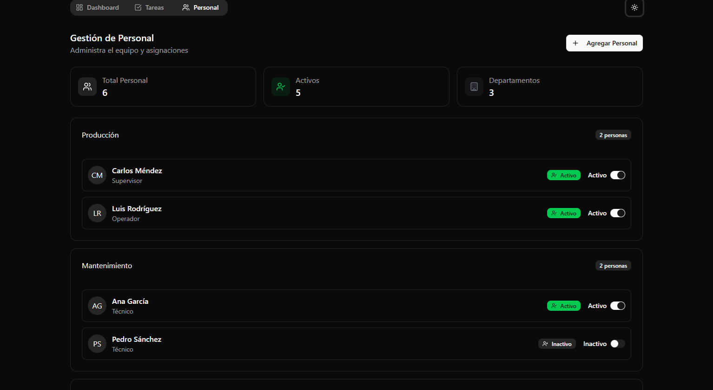

# App de Tareas Industrial

**App de Tareas Industrial** es una solución integral para la gestión operativa en entornos industriales. Permite a las empresas organizar, asignar y monitorear tareas, así como gestionar el personal, optimizar procesos y mejorar la productividad.

---

## Tabla de contenidos

- [Características principales](#características-principales)
- [Áreas del programa](#áreas-del-programa)
  - [Dashboard](#dashboard)
  - [Gestión de tareas](#gestión-de-tareas)
  - [Gestión de personal](#gestión-de-personal)
- [Instalación](#instalación)
- [Contribución](#contribución)
- [Licencia](#licencia)
- [Contacto](#contacto)

---

## Características principales

- **Dashboard interactivo** para monitorear el estado general de operaciones.
- **Gestión avanzada de tareas**: creación, asignación, seguimiento y cierre.
- **Gestión de personal**: registro, asignación de roles y control de desempeño.
- **Historial y reportes** de actividades.
- **Control de equipos y áreas**.
- **Interfaz amigable**, adaptable a diferentes dispositivos.

---

## Áreas del programa

### Dashboard

El dashboard ofrece una vista general y centralizada de todas las operaciones del sistema, permitiendo controlar el avance de las tareas, el rendimiento del personal y el estado de las áreas de trabajo.



- Visualización de tareas activas, pendientes y completadas.
- Indicadores de desempeño y alertas.
- Acceso rápido a las principales acciones administrativas.

---

### Gestión de tareas

Esta sección permite a los usuarios crear, asignar y dar seguimiento a tareas específicas dentro de diferentes áreas de la empresa.



- Creación y edición de tareas con descripción, prioridad y fecha límite.
- Asignación de responsables y equipos.
- Seguimiento del progreso y cierre de tareas.
- Filtros por estado, área y responsable.

---

### Gestión de personal

Permite administrar la plantilla de trabajadores, sus roles y su desempeño dentro del sistema.



- Registro y edición de datos de empleados.
- Asignación de roles y áreas de trabajo.
- Control de desempeño y cumplimiento.
- Historial de tareas realizadas por cada empleado.

---

## Instalación

1. Clona el repositorio:
   ```bash
   git clone https://github.com/lagarlabs/app-de-tareas-industrial.git
   ```
2. Instala las dependencias:
   ```bash
   npm install
   ```
3. Ejecuta la aplicación:
   ```bash
   npm start
   ```

---

## Contribución

¿Quieres mejorar la aplicación? Haz un fork del repositorio, realiza tus cambios y envía un pull request. Toda colaboración es bienvenida.

---

## Licencia

Este proyecto está bajo la licencia MIT.

---

## Contacto

Para dudas o sugerencias, abre un issue en este repositorio o contacta al equipo de desarrollo.

---
